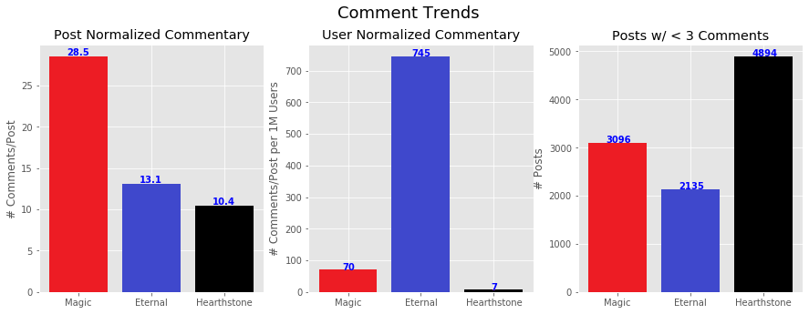

# Building an Eternal Community

- [Problem Statement](#Problem-Statement)
- [Project Summary](#Project-Summary)
- [Project Files](#Project-Files)
- [Data Dictionary](#Data-Dictionary)
- [Exploratory Data Analysis (EDA)](#Exploratory-Data-Analysis-(EDA))
- [Data Models](#Data-Models)
- [Conclusions](#Conclusions)

---

### Problem Statement

Trading card games (TCGs) have been a popular form of entertainment for more than 25 years, ever since Magic: the Gathering launched the genre in 1993. Since then, many other tcgs have risen to compete in the market, often based on established franchises such as Pokemon, Yu-gi-oh!, and Star Wars. With the increasing prevalence of computers and smart phones, a new era of digital card games has begun, of which the most notable is Hearthstone, based on the popular Warcraft series by Blizzard Entertainment. Dire Wolf Digital has taken the bold step of creating Eternal, a digital card game without the security of an already well-known franchise, but has grown a loyal fanbase due to its strong gameplay and design. In order to continue growing that player base, it is important to develop a strong sense of community among the players, one where new players are welcomed and where members find fun and exciting stories to tell. However, to keep developing the community, it is important to understand what the players are talking about, and why they choose to play Eternal when there are many other options available. The question therefore is to determine what these topics are in order to allocate resources to maximize community development.

---

### Project Summary

To gauge community interests, I analyze post titles pulled from the Eternal subreddit. In order to compare to other TCGs, I pulled posts from the main Magic and Hearthstone subreddits as well, as these games are the most well known physical and digital tcgs, respectively. Approximately 10,000 posts for each game were pulled from a two year time period (2018 - 2020) to gauge general community discussions that aren't focused on a particular time period. We apply Natural Language Processing (NLP) and machine learning in order to create models to determine what topics are important to the Eternal community that differentiate it from other, similar, games.

---

### Project Files

The project files are organized as follows:  
  
**Main Directory/**  
- README.md: Project summary document (this file)
- [presentation.pdf](presentation.pdf): Project presentation slides    
- **code**/
 - [general_functions.py](code/general_functions.py): Python file containing generic functions for exploring/cleaning dataframes and chart creation
 - [p3_functions.py](code/p3_functions.py): Python file containing project specific functions in order to reduce excess code in project notebooks
 - [p3_collection.ipynb](code/p3_collection.ipynb): Notebook containing code for pulling data from Reddit, as well as reading in card lists for each game
 - [p3_eda.ipynb](code/p3_eda.ipynb): Notebook containing exploratory data analysis and conclusions drawn from the initial analysis
 - [p3_model.ipynb](code/p3_model.ipynb): Notebook containing model instantiation, fitting, and evaluation, as well as conclusions and recommendations based on the information generated from the models
- **datasets**/
 - [tcg_raw.csv](datasets/tcg_raw.csv): CSV file that is created from the data collection which contains all the posts pulled from Reddit. Reading this file removes the need to request information from Reddit each time this project's code is run
 - [eternal_cards.csv](datasets/eternal_cards.csv): CSV file containing the names of all the cards currently in Eternal. [Source](https://eternalwarcry.com/cards?cardview=false)
 - [hearthstone_cards.csv](datasets/hearthstone_cards.csv): CSV file containing detailed information on all of the cards currently in Hearthstone, of which only the name is utilized for this project. [Source](https://www.reddit.com/r/hearthstone/comments/g573bt/all_hearthstone_cards_listed_in_spreadsheet/)
 - [mtg_cards.csv](datasets/mtg_cards.csv): CSV file containing the names of all the cards from the past two years for Magic. This CSV was created from a larger JSON file containing detailed information for all cards in Magic. [Source](https://mtgjson.com/downloads/all-files/)
- **images**/: Directory containing image files for figures and charts

---

### Data Dictionary

The data from Reddit was collected and organized in a dataframe containing the following information

|Feature|Type|Description|
|---|---|---|
num_comments|int|The number of comments associated with a given post
title|str|The title of the pulled post
ptitle|str|The title of the post modified for NLP. Non-alphabetical characters are removed and all characters are converted to lower case. Each word is lemmatized using Python's WordNetLemmatizer
sub|int|The subreddit from which the post originated from, encoded as integers: 0 (Magic), 1 (Eternal), and 2 (Hearthstone)

---

### Exploratory Data Analysis (EDA)

When analyzing the Reddit data, I am primarily interested in measuring community involvement and the topics that generate the greatest amount of discussion. I used the number of comments as a metric for player interest, as this involves direct input from players on posts that they feel is worth responding to. It is important to note here that the number of members belonging to each community on Reddit is greatly imbalanced: the Eternal subreddit has around 18,000 members (as of July, 2020), while the main Magic subreddit has 400,000, and Hearthstone boasts nearly 1.5 million members.

Overall, if normalized by number of users, the Eternal community is by far the most vocal of the three games (Fig. 1, middle). Another way of assessing this is quantifying the number of posts that generate little to no discussion, which I defined as having less than three comments (Fig. 1, right). Only about 20% of posts on the Eternal subreddit generated fewer than three comments, while Magic has around 30% and nearly half of Hearthstone's posts don't see much discussion. This is a good sign for the game, suggesting that while the community is overall smaller, Eternal members are generally more invested in the game and its community. It is important to note that I did not track comment authorship, so it is possible that this could be an artifact of an extremely vocal subset of users. However, given the number of posts analyzed, this does not seem likely, although it may still be of use to track this information in the future.

**Figure 1**. Subreddit commentary analysis  
  
When I examined the posts that generated the most discussion overall, it was clear that the topic of card balance caused the most response among the Eternal members. Seven of the top ten posts by commments were related to game balance (table 1). While this is a positive sign that players care deeply about gameplay, which is the core of any successful game, it could also highlight a lack of other avenues of generating interest, especially for people who are not yet playing the game and would have less investment in card balance. For example, several of the top posts for the Hearthstone subreddit were about Blizzcon, Blizzard's annual gaming convention. While there is of course a difference in resources available, finding alternate avenues for generating excitement will be valuable for drawing in potential new players.

**Table 1**. Top Eternal posts by comment 

|Post Title|Comments|
|---|---|
Moderator Team Statement on AlpacaLips Ban|595 comments
6/25/19 Balance Changes|384 comments
12/4 Balance Changes|328 comments
Balance Changes 1/6|286 comments
10/21 Balance Changes|271 comments
6/6/19 Balance Changes|266 comments
1.42 Balance Changes|248 comments
Defiance Spoilers: Pledge!|228 comments
Game Economy Changes|228 comments
Please make Icaria cost 8 again.|225 comments

Lastly, I wanted to examine how friendly the community is. Creating a welcoming and inviting environment will be critical in integrating new people into the game until they become enfranchised players themselves. I measured friendliness by the number of responses to posts containing the words "new", "help" and "question" (Fig. 2). Of course, this is only a rough measure, as context is lost when examining only single words (although the bigram analysis did show that "new player" was the most common bigram for Eternal), but should still provide a fair estimate for helpful the community is. Eternal, despite its smaller numbers, demonstrates a similar level of responsiveness as Magic members, and higher than Hearthstone for posts containing these words. This is a great sign that the Eternal members are looking out for those who have questions or need help, which do tend to be the newer and less experienced players.

**Figure 2**. "Helpful" comment numbers by subreddit

---

### Data Models
Using machine learning, I created numerous models for the purposes of both prediction and inference. For our predictive models, I selected multinomial naive Bayes and a random forest classifier, both of which yielded around 80% accuracy in determining which subreddit a particular post came from. Overall, this accuracy could likely be increased by expanding the range of parameters tested, but since the utility of predicting to which subreddit a post belongs to is not very high, this is not a particularly high priority. Unsurprisingly, nearly all of the best words for identification were game specific, with the top four being the names of the games themselves: Eternal, Magic, MTG, and Hearthstone (Fig. 3).

**Figure 3**. Random forest classifier feature importances

For inferential analysis, I attempted to remove all words that were game-specific, as well as general terms applicable to all TCGs. This includes all card names, game formats, mechanics and terminology. This was done in order to glean information on more community driven topics. As expected, the accuracy for the models dropped dramatically by removing many key identifiers. To mitigate this, I utilized a one-vs-all approach, where the models were run for each game and compared against the other two. In addition, I also employed five different models, and aggregated each word's rank from each model in order to generate a word's final score (table 2).

**Table 2**. Top inferential words by subreddit

|Rank|Magic|Eternal|Hearthstone|
|---|---|---|---|
1|booster|scarlatch|class
2|prerelease|twitch|bob
3|lgs|highlight|lethal
4|ruling|thread|highlander
5|reprint|xbox|nerfs
6|myb|chronicle|otk
7|edition|achievement|hp
8|sleeve|monday|odd
9|maro|sunday|solo
10|paper|farming|til

Looking at the words associated with Eternal, several stand out as potential areas of interest. Prominently, several non-game related words rose to the top using this method. Scarlatch, a member of Dire Wolf Digital, is number one due to their interaction with the community in the game itself. Similarly, Twitch appears second on the list, suggesting that the platform is important for connecting players to streamers who play Eternal. Fostering these kinds of more personable relationships can increase player investment and promote a sense of community outside of the game. This can be seen for Magic as well; Maro is the nickname for Mark Rosewater, the head of Magic R&D who regularly interacts with fans on social media as well as official channels.  

The other words of interest are "Xbox" and "chronicle," which both represent alternative platforms to interacting with the game beyond on a computer. While all three games can be played digitally, Eternal is the only game to be offered on video game consoles, which is a potentially untapped market ("switch" was number 11 on the list, likely referring to the Nintendo console). Similarly, chronicle is likely referring to Eternal: Chronicles of the Throne, a board game which ties into the Eternal world and mythos. This could again be a potential way to reach people who may be interested in other forms of gaming.

### Conclusions

In summary, I analyzed a data set of over 30,000 reddit posts from Eternal, Magic, and Hearthstone in order to glean information on the state of the Eternal reddit community. What I found is that while the Eternal subreddit may not have many members, it is both friendly and active, meaning that Dire Wolf Digital has created a strong foundation for an enduring player base.

Secondly, in order to maintain and grow player enthusiasm and investment, I believe that promoting the activities of prominent community members such as streamers or skilled players, based on my preliminary analysis. Fostering charismatic and entertaining figures among Eternal fans helps keep players connected, even when balance or gameplay might be at a lower point, which is essential for player retention.

Lastly, growing the community is not possible unless new players join the ranks of Eternal players. Exploring the alternate methods of play, such as board games and video game consoles, will allow Eternal to reach gamers who may not have already interacted with older TCGs such as Magic and Hearthstone. I believe continuing to focus resources on these areas will yield positive results for the game's future.

An important caveat here is that I only analyzed word and comment frequency. In order to gain a fuller understanding of the community as a whole, more complex measures such as comment and sentiment analysis would have to be conducted to determine whether these topics are important because they are going well, or because the players are having a problem with them. However, the work conducted here provides a good starting point for the areas that are worth the increased scrutiny and resources. By utilizing the power of data, I believe we can make Eternal one of the greatest TCGs, as it deserves to be.